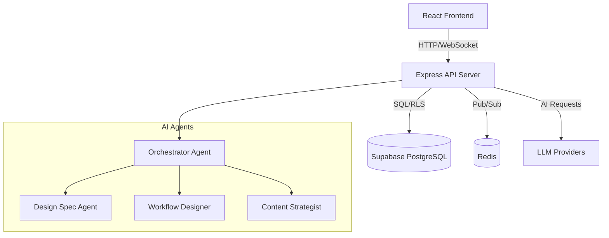
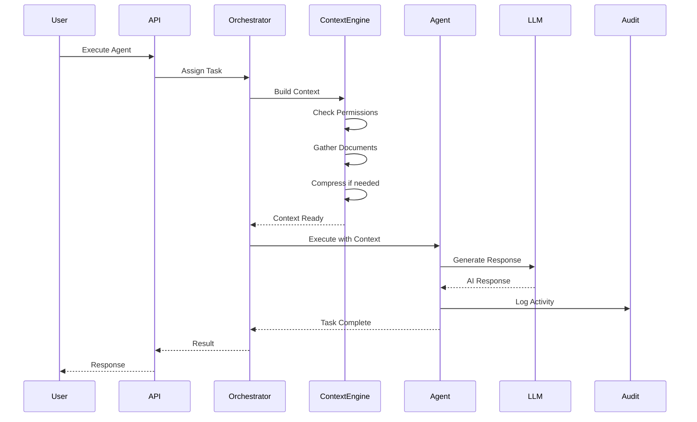

# AYAZMA-ONE Architecture

## System Overview

AYAZMA-ONE is an AI-powered project management and agent orchestration platform that enables intelligent automation through specialized AI agents.

## High-Level Architecture



## Core Components

### 1. Frontend (React + TypeScript)

- **Location**: `src/`
- **Tech Stack**: React, TypeScript, TailwindCSS, React Router
- **Key Features**:
  - Project management UI
  - Agent execution interface
  - Real-time updates via Supabase Realtime
  - Permission management UI

### 2. Backend API (Express + TypeScript)

- **Location**: `api/`
- **Tech Stack**: Express, TypeScript, Supabase Client
- **Key Modules**:
  - **Auth**: User authentication and authorization
  - **Projects**: Project CRUD operations
  - **Agents**: Agent orchestration and execution
  - **AI**: LLM provider abstraction
  - **Context Engineer**: Context building and compression
  - **Audit**: Activity logging and querying
  - **Pub/Sub**: Agent messaging system

### 3. Database (Supabase PostgreSQL)

- **Location**: `supabase/migrations/`
- **Key Tables**:
  - `users` - User accounts
  - `projects` - Project data
  - `project_documents` - Project documents
  - `agent_runs` - Agent execution history
  - `agent_activities` - Detailed activity logs
  - `agent_permissions` - Agent access control
  - `personal_tasks` - User tasks

### 4. Message Queue (Redis + BullMQ)

- **Purpose**: Reliable message delivery between agents
- **Features**:
  - Job queuing
  - Pub/Sub messaging
  - Request-response patterns

## Data Flow

### Agent Execution Flow



## Security Architecture

### Row Level Security (RLS)

- All tables have RLS enabled
- Users can only access their own data
- Agents require explicit permissions via `agent_permissions` table

### Permission Model

```typescript
type PermissionLevel = 'none' | 'read' | 'write'

interface AgentPermission {
  userId: string
  projectId: string
  agentName: string
  permission: PermissionLevel
}
```

## Scalability Considerations

### Horizontal Scaling

- Stateless API servers
- Redis for shared state
- BullMQ for distributed job processing

### Performance Optimizations

- Context compression to reduce token usage
- Caching frequently accessed data
- Lazy loading of documents
- Connection pooling for database

## Technology Stack

### Frontend

- React 18
- TypeScript
- TailwindCSS
- React Router
- Supabase Client

### Backend

- Node.js
- Express
- TypeScript
- Supabase (PostgreSQL + Realtime)
- Redis
- BullMQ

### AI/ML

- OpenAI GPT-4
- Google Gemini
- LangChain (for context compression)

### DevOps

- Docker
- GitHub Actions
- Supabase CLI

## Directory Structure

```
AYAZMA_ONE_v2/
├── api/                    # Backend API
│   ├── config/            # Configuration
│   ├── core/              # Core utilities
│   ├── middleware/        # Express middleware
│   ├── modules/           # Feature modules
│   │   ├── agents/       # Agent orchestration
│   │   ├── ai/           # LLM providers
│   │   ├── audit/        # Activity logging
│   │   ├── context-engineer/  # Context building
│   │   ├── pubsub/       # Messaging system
│   │   └── security/     # Permission service
│   └── routes/           # API routes
├── src/                   # Frontend React app
│   ├── components/       # React components
│   ├── pages/           # Page components
│   └── lib/             # Utilities
├── supabase/             # Database
│   └── migrations/      # SQL migrations
├── tests/               # Unit tests
└── docs/                # Documentation
```

## Monitoring and Observability

### Logging

- Structured logging with Pino
- Log levels: debug, info, warn, error
- Contextual logging with request IDs

### Audit Trail

- All agent activities logged to `agent_activities` table
- Query API: `/api/audit/activities`
- Statistics API: `/api/audit/stats/:projectId`

### Metrics

- Agent execution times
- Token usage
- Cost tracking
- Error rates

## Future Enhancements

- [ ] Multi-tenancy support
- [ ] Advanced caching strategies
- [ ] GraphQL API
- [ ] Webhook support
- [ ] Plugin system for custom agents
