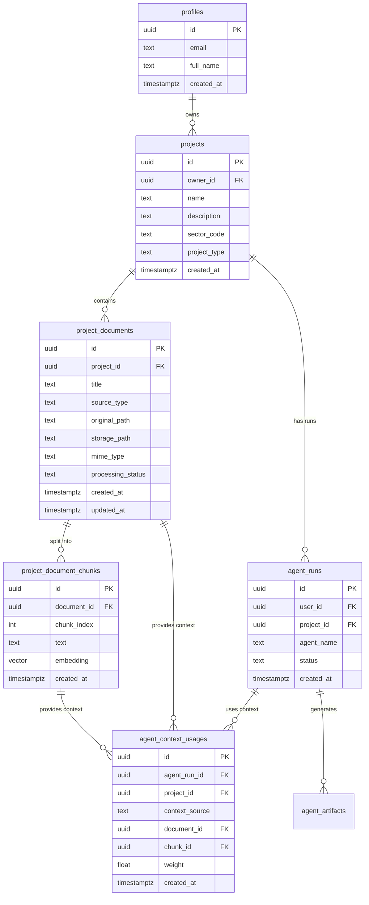
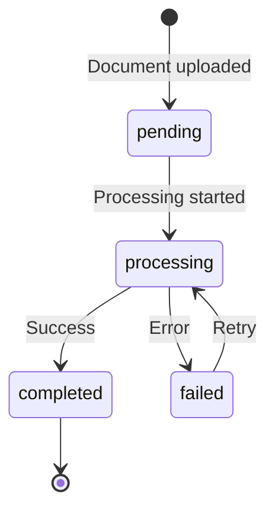

# Context Layer & RAG Schema Documentation

## Overview

This document describes the database schema for the Context Layer 2.0 and RAG (Retrieval-Augmented Generation) system in AYAZMA-ONE. The schema enables project-based document management, semantic search, and context-aware agent execution.

---

## Entity Relationship Diagram



---

## Table Definitions

### `project_documents`

Stores metadata for documents uploaded to projects. Documents are processed asynchronously to extract text and generate embeddings.

| Column | Type | Constraints | Description |
|--------|------|-------------|-------------|
| `id` | UUID | PRIMARY KEY, DEFAULT gen_random_uuid() | Unique document identifier |
| `project_id` | UUID | NOT NULL, REFERENCES projects(id) ON DELETE CASCADE | Parent project |
| `title` | TEXT | NOT NULL | Document title (from filename or user input) |
| `source_type` | TEXT | NOT NULL, CHECK IN ('upload', 'url', 'note', 'other') | How document was added |
| `original_path` | TEXT | NULLABLE | Original filename or URL |
| `storage_path` | TEXT | NOT NULL | Path in Supabase Storage or S3 |
| `mime_type` | TEXT | NOT NULL | MIME type (e.g., 'application/pdf') |
| `processing_status` | TEXT | NOT NULL, DEFAULT 'pending', CHECK IN ('pending', 'processing', 'completed', 'failed') | Processing pipeline status |
| `created_at` | TIMESTAMPTZ | DEFAULT now() | Upload timestamp |
| `updated_at` | TIMESTAMPTZ | DEFAULT now() | Last update timestamp |

**Indexes**:

- `idx_project_documents_project_id` on `project_id`
- `idx_project_documents_status` on `processing_status`
- `idx_project_documents_created_at` on `created_at DESC`

**RLS Policies**:

- **SELECT**: Users can view documents from projects they own

  ```sql
  CREATE POLICY project_documents_select_own ON project_documents
  FOR SELECT USING (
    EXISTS (
      SELECT 1 FROM projects p 
      WHERE p.id = project_id AND p.owner_id = auth.uid()
    )
  );
  ```

- **INSERT**: Users can upload documents to their own projects
- **UPDATE**: Users can update documents in their own projects
- **DELETE**: Users can delete documents from their own projects

---

### `project_document_chunks`

Stores text chunks extracted from documents along with their vector embeddings for semantic search.

| Column | Type | Constraints | Description |
|--------|------|-------------|-------------|
| `id` | UUID | PRIMARY KEY, DEFAULT gen_random_uuid() | Unique chunk identifier |
| `document_id` | UUID | NOT NULL, REFERENCES project_documents(id) ON DELETE CASCADE | Parent document |
| `chunk_index` | INT | NOT NULL | Sequential index within document (0-based) |
| `text` | TEXT | NOT NULL | Chunk text content (500-1000 tokens) |
| `embedding` | VECTOR(1536) | NOT NULL | Vector embedding for semantic search |
| `created_at` | TIMESTAMPTZ | DEFAULT now() | Creation timestamp |

**Indexes**:

- `idx_document_chunks_document_id` on `document_id`
- `idx_document_chunks_chunk_index` on `chunk_index`
- `idx_document_chunks_embedding` on `embedding` using HNSW or IVFFlat (vector index)

**Vector Index Details**:

```sql
-- HNSW index (better for accuracy, slower build)
CREATE INDEX idx_document_chunks_embedding ON project_document_chunks 
USING hnsw (embedding vector_cosine_ops);

-- OR IVFFlat index (faster build, good for large datasets)
CREATE INDEX idx_document_chunks_embedding ON project_document_chunks 
USING ivfflat (embedding vector_cosine_ops) WITH (lists = 100);
```

**RLS Policies**:

- **SELECT**: Users can view chunks from documents in their own projects

  ```sql
  CREATE POLICY document_chunks_select_own ON project_document_chunks
  FOR SELECT USING (
    EXISTS (
      SELECT 1 FROM project_documents pd
      JOIN projects p ON p.id = pd.project_id
      WHERE pd.id = document_id AND p.owner_id = auth.uid()
    )
  );
  ```

- **INSERT**: System-only (chunks created by processing pipeline)
- **DELETE**: Cascade from parent document

---

### `agent_context_usages`

Logs which context sources were used for each agent run, enabling transparency and debugging.

| Column | Type | Constraints | Description |
|--------|------|-------------|-------------|
| `id` | UUID | PRIMARY KEY, DEFAULT gen_random_uuid() | Unique usage record identifier |
| `agent_run_id` | UUID | NOT NULL, REFERENCES agent_runs(id) ON DELETE CASCADE | Parent agent run |
| `project_id` | UUID | NULLABLE, REFERENCES projects(id) ON DELETE SET NULL | Related project (if applicable) |
| `context_source` | TEXT | NOT NULL, CHECK IN ('project_meta', 'document', 'history', 'telemetry', 'user_profile', 'other') | Type of context source |
| `document_id` | UUID | NULLABLE, REFERENCES project_documents(id) ON DELETE SET NULL | Source document (if context_source = 'document') |
| `chunk_id` | UUID | NULLABLE, REFERENCES project_document_chunks(id) ON DELETE SET NULL | Source chunk (if applicable) |
| `weight` | FLOAT | DEFAULT 1.0 | Relevance weight (0.0 - 1.0) |
| `created_at` | TIMESTAMPTZ | DEFAULT now() | Usage timestamp |

**Indexes**:

- `idx_context_usages_run_id` on `agent_run_id`
- `idx_context_usages_project_id` on `project_id`
- `idx_context_usages_created_at` on `created_at DESC`

**RLS Policies**:

- **SELECT**: Users can view context usage from their own agent runs

  ```sql
  CREATE POLICY context_usages_select_own ON agent_context_usages
  FOR SELECT USING (
    EXISTS (
      SELECT 1 FROM agent_runs r 
      WHERE r.id = agent_run_id AND r.user_id = auth.uid()
    )
  );
  ```

- **INSERT**: System-only (logged by agent runner)

---

## Context Source Types

| Source Type | Description | Example Use Case |
|-------------|-------------|------------------|
| `project_meta` | Project name, description, sector, type | Provide basic project context to all agents |
| `document` | Chunks from uploaded documents | RAG search results for relevant documentation |
| `history` | Previous agent runs and artifacts | Learn from past agent outputs |
| `telemetry` | Usage analytics and metrics | Inform agents about user behavior |
| `user_profile` | User preferences and settings | Personalize agent responses |
| `other` | Custom context sources | Extensibility for future features |

---

## Processing Status Flow



**Status Descriptions**:

- **pending**: Document uploaded, waiting for processing
- **processing**: Text extraction and chunking in progress
- **completed**: All chunks created and embeddings generated
- **failed**: Processing error (e.g., corrupted file, API failure)

---

## Vector Similarity Search

### Cosine Similarity Query

```sql
-- Find top 10 most similar chunks to a query embedding
SELECT 
  c.id,
  c.text,
  c.chunk_index,
  d.title AS document_title,
  1 - (c.embedding <=> $1::vector) AS similarity
FROM project_document_chunks c
JOIN project_documents d ON d.id = c.document_id
WHERE d.project_id = $2
ORDER BY c.embedding <=> $1::vector
LIMIT 10;
```

**Parameters**:

- `$1`: Query embedding (vector)
- `$2`: Project ID (UUID)

**Operators**:

- `<=>`: Cosine distance (lower is more similar)
- `<->`: Euclidean distance
- `<#>`: Negative inner product

---

## Storage Estimates

### Per Document

- **Metadata**: ~500 bytes (project_documents row)
- **Text**: Variable (original document size)
- **Chunks**: ~200 chunks for 100-page document
  - Text: ~500 bytes per chunk × 200 = 100 KB
  - Embedding: 1536 dimensions × 4 bytes = 6 KB per chunk × 200 = 1.2 MB
- **Total per document**: ~1.3 MB

### Scaling

- **100 documents**: ~130 MB
- **1,000 documents**: ~1.3 GB
- **10,000 documents**: ~13 GB

**Recommendation**: Monitor database size and consider archiving old documents or implementing tiered storage for large deployments.

---

## Performance Optimization

### Indexing Strategy

1. **Vector Index**: Use HNSW for best accuracy, IVFFlat for large datasets
2. **Foreign Key Indexes**: Automatically created on FK columns
3. **Composite Indexes**: Consider for common query patterns

   ```sql
   CREATE INDEX idx_chunks_doc_index ON project_document_chunks(document_id, chunk_index);
   ```

### Query Optimization

1. **Limit Results**: Always use `LIMIT` in vector searches
2. **Filter Before Search**: Apply project_id filter before vector similarity
3. **Batch Embeddings**: Generate embeddings in batches to reduce API calls
4. **Cache Embeddings**: Cache query embeddings for repeated searches

### Monitoring

Track these metrics:

- Average chunk count per document
- Vector search latency (p50, p95, p99)
- Embedding generation time
- Database size growth rate

---

## Migration Script

See [011_project_documents.sql](file:///c:/Users/tayla/OneDrive/Masaüstü/AYAZMA-ONE/AYAZMA_ONE_v2/supabase/migrations/011_project_documents.sql) for the complete migration script.

---

## Example Queries

### List Documents for Project

```sql
SELECT 
  id,
  title,
  source_type,
  mime_type,
  processing_status,
  created_at
FROM project_documents
WHERE project_id = $1
ORDER BY created_at DESC;
```

### Get Chunks for Document

```sql
SELECT 
  id,
  chunk_index,
  text,
  created_at
FROM project_document_chunks
WHERE document_id = $1
ORDER BY chunk_index ASC;
```

### Get Context Usage for Agent Run

```sql
SELECT 
  cu.context_source,
  cu.weight,
  d.title AS document_title,
  c.text AS chunk_text
FROM agent_context_usages cu
LEFT JOIN project_documents d ON d.id = cu.document_id
LEFT JOIN project_document_chunks c ON c.id = cu.chunk_id
WHERE cu.agent_run_id = $1
ORDER BY cu.weight DESC;
```

---

## Security Considerations

1. **RLS Enforcement**: All tables have RLS enabled and policies enforce user ownership
2. **File Validation**: Backend validates file types and sizes before upload
3. **Storage Isolation**: Documents stored in user-specific paths
4. **Embedding Security**: Embeddings cannot leak sensitive data (they're mathematical representations)
5. **SQL Injection**: Use parameterized queries for all vector searches

---

## Future Enhancements

1. **Multi-modal Embeddings**: Support image and audio embeddings
2. **Hybrid Search**: Combine vector search with keyword search (BM25)
3. **Chunk Metadata**: Add page numbers, section headers, etc.
4. **Reranking**: Use cross-encoder models to rerank search results
5. **Incremental Updates**: Update embeddings when documents change
6. **Compression**: Use quantized embeddings to reduce storage

---

**Last Updated**: November 2025  
**Version**: 2.0
