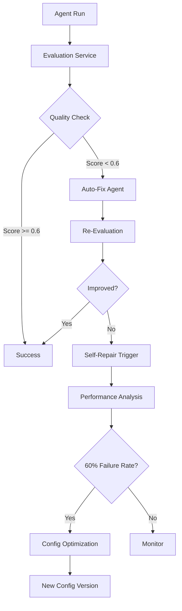

# Stage 6: Self-Evaluation, Auto-Fix & Regression Pipeline - Master QA Loop

## Overview

Stage 6 transforms AYAZMA-ONE from a passive tool into a self-managing, self-healing AI platform. The system continuously evaluates its own outputs, detects quality issues, automatically fixes problems, and optimizes its own configuration through self-repair mechanisms.

## Architecture



## Components

### 1. Universal Eval Matrix (`config/eval_matrix.json`)

Task-type specific evaluation criteria with weighted metrics:

- **analysis**: depth, accuracy, insights, structure, evidence
- **design**: feasibility, usability, completeness, aesthetics, scalability
- **workflow**: step_accuracy, dependency_analysis, completeness, error_handling
- **content_generation**: relevance, quality, originality, tone, structure
- **code_generation**: functionality, security, optimization, maintainability, error_handling
- **legal_document**: accuracy, compliance, risk_identification, completeness, clarity
- **web_research**: source_quality, url_accuracy, comprehensiveness, recency
- **data_extraction**: accuracy, completeness, structure, consistency, validation
- **decision_support**: logic_chain, data_driven, risk_analysis, actionability, alternatives
- **general**: quality, relevance, completeness, clarity, usefulness

Each metric has a weight (0-1) and description. Quality thresholds:

- Excellent: >= 0.85
- Good: >= 0.7
- Acceptable: >= 0.6
- **Needs Fix: < 0.6**

### 2. Enhanced EvalService (`api/modules/eval/evalService.ts`)

Multi-metric evaluation using LLM:

```typescript
async evaluateAgentRun(input: EvalInput): Promise<EvalResult>
```

**Process:**

1. Load task-type specific metrics from eval matrix
2. Build evaluation prompt with metrics
3. Call LLM (GPT-4o-mini) for objective scoring
4. Parse multi-metric scores (0-1 scale)
5. Calculate weighted overall score
6. Set `needs_fix` flag if score < 0.6
7. Save to `agent_evaluations` table

**Database Schema:**

```sql
ALTER TABLE agent_evaluations ADD COLUMN
  task_type TEXT,
  metric_scores JSONB,
  needs_fix BOOLEAN,
  weighted_score DECIMAL(3,2);
```

### 3. Auto-Fix Agent (`api/modules/agents/autoFixAgent.ts`)

Automatically corrects low-quality outputs:

```typescript
async attemptAutoFix(input: AutoFixInput): Promise<AutoFixResult>
```

**Fix Strategies:**

- **Clarification**: Improve clarity and explanations
- **Correction**: Fix factual errors
- **Enhancement**: Add missing information
- **Restructure**: Reorganize for better flow

**Process:**

1. Determine fix strategy based on metric scores
2. Build fix prompt with evaluation feedback
3. Call LLM (GPT-4o) for improved output
4. Parse fixed output and change notes
5. Save to `agent_fixes` table
6. Return for re-evaluation

**Database Schema:**

```sql
CREATE TABLE agent_fixes (
  id UUID PRIMARY KEY,
  agent_run_id UUID REFERENCES agent_runs(id),
  original_output TEXT,
  fixed_output TEXT,
  fix_notes TEXT,
  diff_summary TEXT,
  eval_score_before DECIMAL(3,2),
  eval_score_after DECIMAL(3,2),
  improvement_percentage DECIMAL(5,2),
  fix_strategy TEXT
);
```

### 4. Self-Repair Pipeline

#### Self-Repair Service (`api/modules/agents/selfRepairService.ts`)

Monitors agent performance and optimizes configurations:

```typescript
async analyzePerformance(agentName: AgentName): Promise<PerformanceAnalysis>
async generateRepairSuggestions(agentName, performance): Promise<RepairSuggestion>
async applyRepair(agentName, suggestions, userId): Promise<void>
```

**Trigger Conditions:**

- Analyzes last 10 runs
- Triggers if 60%+ runs have `needs_fix = true`

**Optimization Areas:**

- Prompt template refinement
- System prompt improvements
- Temperature adjustments (0-1)
- Max tokens optimization
- Context strategy changes

**Database Schema:**

```sql
CREATE TABLE agent_configs (
  id UUID PRIMARY KEY,
  agent_name TEXT,
  version INTEGER,
  prompt_template TEXT,
  system_prompt TEXT,
  temperature DECIMAL(3,2),
  max_tokens INTEGER,
  context_strategy TEXT,
  is_active BOOLEAN,
  replaced_by UUID REFERENCES agent_configs(id)
);
```

#### Self-Repair Worker (`api/jobs/selfRepairWorker.ts`)

BullMQ worker that runs performance checks:

- Scheduled nightly or on-demand
- Analyzes all agents
- Applies repairs automatically
- Logs to audit trail

### 5. Closed-Loop Mode

Full autonomous pipeline in `AgentRunner.ts`:

```typescript
// After successful run
if (settings?.closed_loop_mode) {
  await closedLoopQueue.add('evaluate_run', { runId, projectId, userId });
}
```

**Closed-Loop Worker** (`api/jobs/closedLoopWorker.ts`):

1. **evaluate_run**: Evaluate output → if needs_fix → trigger auto_fix
2. **auto_fix**: Fix output → re-run agent → re-evaluate
3. **Max iterations**: 3 attempts, then mark as `max_iterations_reached`

**Database:**

```sql
ALTER TABLE project_ai_settings ADD COLUMN
  closed_loop_mode BOOLEAN DEFAULT false,
  max_iterations INTEGER DEFAULT 3;

ALTER TABLE agent_runs ADD COLUMN
  closed_loop_status TEXT, -- 'pending', 'in_progress', 'completed', 'failed', 'max_iterations_reached'
  parent_run_id UUID REFERENCES agent_runs(id),
  iteration_count INTEGER DEFAULT 0;
```

### 6. Regression Framework

Prevents quality degradation:

**Database:**

```sql
CREATE TABLE regression_tests (
  id UUID PRIMARY KEY,
  agent_name TEXT,
  input_payload JSONB,
  expected_characteristics JSONB,
  severity TEXT -- 'critical', 'high', 'medium', 'low'
);

CREATE TABLE regression_results (
  id UUID PRIMARY KEY,
  test_id UUID REFERENCES regression_tests(id),
  agent_run_id UUID,
  passed BOOLEAN,
  failure_reason TEXT
);
```

**Regression Worker** (`api/jobs/regressionTestWorker.ts`):

- Runs nightly
- Executes all tests
- Compares outputs against expected characteristics
- Flags failures in Cockpit

### 7. Health Monitoring

**Health Service** (`api/modules/health/healthService.ts`):

```typescript
async getTrends(period: '7d' | '30d'): Promise<HealthTrends>
```

**Metrics Tracked:**

- Average quality score (0-1)
- Average cost per run
- Average latency (ms)
- Auto-fix count
- Regression failure count
- Self-repair success rate
- Daily breakdowns

**API Endpoint:**

```
GET /api/health/trends?period=7d
```

### 8. Cockpit Dashboard

**StabilityQAPanel** (`src/components/cockpit/StabilityQAPanel.tsx`):

Displays:

- Last 20 evaluation results (line chart)
- Auto-fix events timeline
- Regression test status
- Self-repair triggers
- Health trends

**API Endpoint:**

```
GET /api/cockpit/qa-metrics
```

Returns:

- Eval history
- Auto-fix events
- Regression failures
- Self-repair logs

## Data Flow

### Normal Run (No Issues)

```
User Request → Agent Run → Evaluation → Score >= 0.6 → Success
```

### Auto-Fix Flow

```
User Request → Agent Run → Evaluation → Score < 0.6 → Auto-Fix → Re-Evaluation → Success
```

### Self-Repair Flow

```
10 Runs → 60% Low Quality → Performance Analysis → LLM Suggestions → New Config Version → Future Runs Use New Config
```

### Closed-Loop Flow

```
Agent Run → Eval (low) → Auto-Fix → Re-Run → Eval (still low) → Auto-Fix → Re-Run → Eval (still low) → Max Iterations → Alert
```

## Configuration

### Enable Closed-Loop Mode

```sql
UPDATE project_ai_settings
SET closed_loop_mode = true,
    max_iterations = 3
WHERE project_id = '<project-id>';
```

### Create Regression Test

```sql
INSERT INTO regression_tests (agent_name, input_payload, expected_characteristics, severity)
VALUES (
  'workflow_agent',
  '{"task": "design deployment pipeline"}',
  '{"has_steps": true, "has_dependencies": true, "has_error_handling": true}',
  'high'
);
```

## Telemetry Events

- `evaluation_completed`: After each evaluation
- `auto_fix_completed`: After auto-fix attempt
- `self_repair_triggered`: When self-repair activates
- `config_version_changed`: When new config applied
- `regression_test_failed`: When regression fails

## Safety Mechanisms

1. **Max Iterations**: Prevents infinite loops (default: 3)
2. **Circuit Breaker**: Stops after repeated failures
3. **Config Versioning**: Easy rollback to previous configs
4. **Audit Logging**: All changes logged
5. **Manual Override**: Users can disable closed-loop mode

## Performance Impact

- **Evaluation**: +500-1000ms per run (async)
- **Auto-Fix**: +2-4s when triggered (async)
- **Self-Repair**: Runs nightly, no user impact
- **Cost**: ~$0.01-0.03 per eval+fix cycle

## Troubleshooting

### High False Positive Rate

- Adjust `needs_fix` threshold in eval_matrix.json
- Review metric weights for task type
- Check LLM evaluation prompts

### Auto-Fix Not Improving Quality

- Review fix strategies
- Check if LLM has enough context
- Consider using GPT-4 instead of GPT-4o-mini

### Self-Repair Breaking Agents

- Review optimization suggestions
- Rollback to previous config version
- Disable self-repair for specific agents

### Infinite Loop in Closed-Loop

- Check max_iterations setting
- Review circuit breaker logic
- Examine agent run logs

## Future Enhancements

- A/B testing for config changes
- Multi-model evaluation consensus
- User feedback integration
- Automated prompt engineering
- Cost optimization strategies
